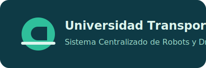
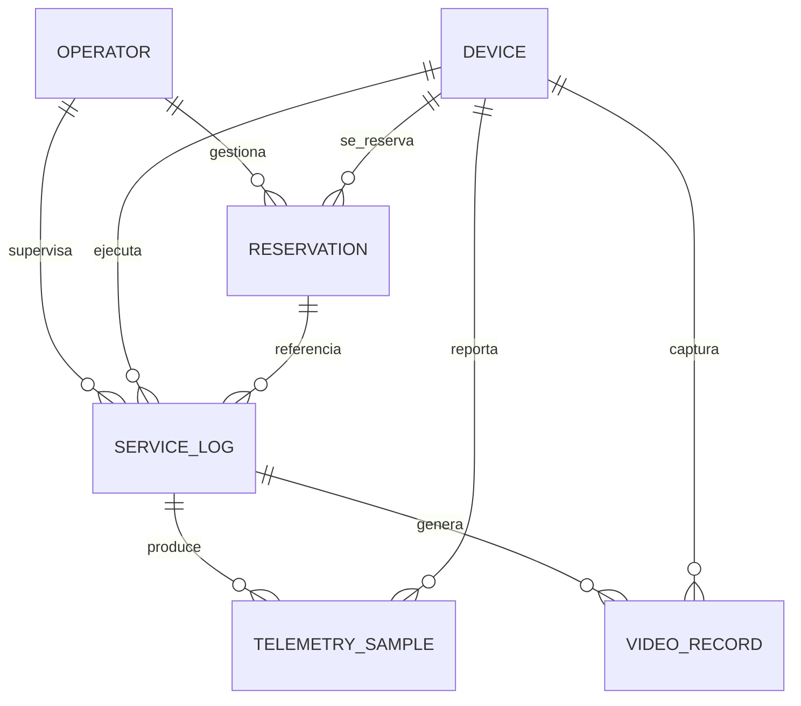

# Sistema Centralizado de Transporte Universitario

<p align="center">
	
</p>

Este proyecto implementa un sistema centralizado para gestionar el uso de robots y drones dentro de una universidad.

## Contexto

La universidad cuenta con dispositivos (robots y drones) para servicios internos como:

- Transporte de documentos y pedidos de cafeteria.
- Grabacion de encuentros artisticos y deportivos.

El objetivo del sistema es eliminar la dependencia de operacion manual por persona y permitir administracion centralizada de inventario, reservas, bitacoras y monitoreo.

## Funcionalidades Minimas Cubiertas

- Administracion de inventario de dispositivos.
- Sistema de reservas para uso de robots/drones.
- Bitacora de servicios (inicio, fin, origen, destino, estado).
- Monitoreo por telemetria (ubicacion, bateria, sensores, estado de carga/servicio).
- Registro de videos por recorrido con URL en servicio cloud.
- Soft Delete con campo `active` en entidades de dominio.

## Stack Tecnologico

- Backend: NestJS + Prisma + PostgreSQL
- Frontend: Next.js (App Router)
- Infraestructura local: Docker Compose

## Modelo de Datos

Entidades principales:

- Operator
- Device
- Reservation
- ServiceLog
- TelemetrySample
- VideoRecord

Diagrama general:



## Requisitos

- Docker Desktop en ejecucion
- Node.js 18+
- npm 9+
- Puerto 5433 disponible para la base de datos de este proyecto

## Instalacion Rapida

1. Levantar base de datos

```powershell
docker compose up -d
```

2. Instalar dependencias

```powershell
cd back
npm install
cd ../front
npm install
```

3. Configurar base de datos y datos iniciales

```powershell
cd ../back
npm run db:setup
```

4. Levantar backend

```powershell
npm run start:dev
```

5. Levantar frontend (otra terminal)

```powershell
cd ../front
npm run dev
```

## URLs de Desarrollo

- Frontend: http://localhost:3000
- Backend: http://localhost:3001
- Health: http://localhost:3001/

## Endpoints Iniciales

### Dispositivos

- GET /devices
- GET /devices/:id
- POST /devices
- PATCH /devices/:id
- DELETE /devices/:id (soft delete)

### Reservas

- GET /reservations
- GET /reservations/:id
- POST /reservations
- PATCH /reservations/:id
- DELETE /reservations/:id (soft delete)

### Bitacora de Servicios

- GET /service-logs
- GET /service-logs/:id
- POST /service-logs
- PATCH /service-logs/:id
- DELETE /service-logs/:id (soft delete)

## Comandos Utiles (Backend)

```powershell
# Generar cliente Prisma
npm run prisma:generate

# Crear/aplicar migraciones
npm run prisma:migrate

# Cargar seed
npm run prisma:seed

# Flujo completo DB (generate + migrate + seed)
npm run db:setup
```

## Estructura Base

```text
back/
	prisma/
		schema.prisma
		seed.js
	src/
		prisma/
		devices/
		reservations/
		service-logs/
front/
	app/
	public/
```

## Nota de Soft Delete

El sistema evita eliminaciones fisicas en operaciones de dominio. En su lugar:

- Se marca `active = false`
- Los listados filtran por `active = true` por defecto

## Siguientes Pasos Recomendados

- Agregar autenticacion por roles (ADMIN, TECHNICIAN, SUPERVISOR).
- Crear modulo de telemetria y modulo de videos con endpoints dedicados.
- Conectar frontend a los endpoints de inventario y reservas.
